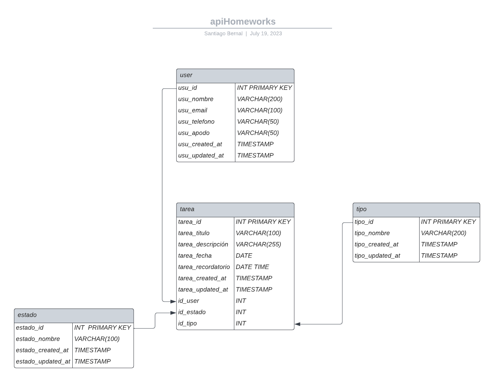

# apiHomeworks
## Objetivo general del proyecto:
Desarrollar una API de tareas que permita a los usuarios gestionar y realizar un seguimiento de sus tareas. La API mostrará las tareas pendientes para los próximos 7 días, brindando a los usuarios una visión clara de sus responsabilidades a corto plazo.

## Objetivo específico del proyecto:
Implementar una funcionalidad en la API de tareas que permita filtrar y mostrar las tareas pendientes que deben completarse en los próximos 7 días. Esto ayudará a los usuarios a organizar y priorizar sus tareas de manera eficiente, proporcionándoles una vista rápida y relevante de sus actividades pendientes a corto plazo. El proyecto se basa en crear una api de tareas la cual va a permitir al usuario registrarse, crear tareas y cada tarea va a estar ligada a un tipo es decir: esta tarea es de matematica, o de ingles etc depende el programa, La idea es presentar al usuario las tareas que tenga pendientes en los proximos 7 dias, la base de datos contará con 4 tablas las cuales serán: user, tarea, tipo, estado
# Diagrama base de datos


## Teconologias utilizadas
<div>
    
    
    
    
    
    
    
</div>

# Instalacion del proyecto
### 1. Debe clonar el repositorio `https://github.com/JhonnSantiagoBernalJuradoCampus/apiHomeworks.git`

### 2. Debera crear el archivo .env y agregarle los datos que estan en el .env.example:
```js
MY_CONFIG = {"hostname": "127.12.1.4", "port": 5510}
DB_CONFIG = {"host": "localhost", "port":"3306", "user": "campus", "password": "campus2023", "database": "homeworks_db"}
```
### 3. - Deberas abrir la terminal de tu editor de codigo y ejecutar el comando `npm i`. El cual instalara todas las dependencias utilizadas
- Deberas ejecutar el comando `npm run dev`
# Despliegue de la base de datos
1. Debes ingresar a phpmyadmin y darle en el boton sql para ingresar el script de el archivo de la carpeta db homeworks_db.sql.
# Dependencias instaladas
- express
- nodemon
- mysql2
- typescript
- reflect-metadata
- dotenv
- class-validator
- class-transformer
- validator
# Endpoints
# User
## Get
### 1. Mostrar todos los user: `http://127.12.1.4:5510/user`
- Ejemplo de datos de salida
```js
[
  {
    "usu_id": 1,
    "usu_nombre": "Jhon Santiago Bernal Jurado",
    "usu_email": "jbernalsantiago11@gmail.com",
    "usu_telefono": "3123860656",
    "usu_apodo": "Bernal",
    "usu_created_at": "2023-07-26T05:00:00.000Z",
    "usu_updated_at": null
  },
  {
    "usu_id": 2,
    "usu_nombre": "Angie Nathalia Suarez Perez",
    "usu_email": "angienatalia@gmail.com",
    "usu_telefono": "3118128060",
    "usu_apodo": "Angie",
    "usu_created_at": "2023-07-26T05:00:00.000Z",
    "usu_updated_at": null
  },
  {
    "usu_id": 3,
    "usu_nombre": "Angela Esperanza Almeida Amaya",
    "usu_email": "angela@gmail.com",
    "usu_telefono": "3118124232",
    "usu_apodo": "Angela",
    "usu_created_at": "2023-07-26T05:00:00.000Z",
    "usu_updated_at": null
  },
  {
    "usu_id": 4,
    "usu_nombre": "James Ronald Bernal Bermudez",
    "usu_email": "ronald@gmail.com",
    "usu_telefono": "312741832",
    "usu_apodo": "James",
    "usu_created_at": "2023-07-26T05:00:00.000Z",
    "usu_updated_at": null
  }
]
```
### 2. Mostrar un user en especifico: `http://127.12.1.4:5510/user/:id`
#### - Debera cambiar el parametro `:id` por un numero
- Ejemplo de datos de salida
```js
[
  {
    "usu_id": 1,
    "usu_nombre": "Jhon Santiago Bernal Jurado",
    "usu_email": "jbernalsantiago11@gmail.com",
    "usu_telefono": "3123860656",
    "usu_apodo": "Bernal",
    "usu_created_at": "2023-07-26T05:00:00.000Z",
    "usu_updated_at": null
  }
]
```
## Post
### 1. Agregar user: `http://127.12.1.4:5510/user/agregar`
2. Ejemplo de los datos a pasar en el post
```js
{
    "usu_nombre": "Angela Esperanza Almeida Xd", 
    "usu_email": "angelajurado@gmail.com", 
    "usu_telefono": "3118124321", 
    "usu_apodo": "Angie"
}
```
## Put
### 1. Editar un user: `http://127.12.1.4:5510/user/editar/:id`
#### - Debera cambiar el parametro `:id` por un numero
2. Ejemplo de los datos a pasar en el put
```js
{
    "usu_nombre": "Angela Esperanza Almeida Suarez", 
    "usu_email": "angelajurado@gmail.com", 
    "usu_telefono": "3118124321", 
    "usu_apodo": "Angie"
}
```
# Estado
## Get
1. Mostrar todos los estado: `http://127.12.1.4:5510/estado`
2. Mostrar un estado en especifico: `http://127.12.1.4:5510/estado/:id`
# Tipo
## Get
1. Mostrar todos los tipo: `http://127.12.1.4:5510/tipo`
2. Mostrar un tipo en especifico: `http://127.12.1.4:5510/tipo/:id`
## Post
1. Agregar tipo `http://127.12.1.4:5510/tipo/agregar`
2. Ejemplo de los datos a pasar en el post
```js
{
    "nombre": "Sociales", 
}
```
## Delete
1. Eliminar tipo: `http://127.12.1.4:5510/tipo/eliminar/:id`
# Tarea
## Get
1. Mostrar todas las tareas que tiene un user en especifico dentro de los proximos 7 dias: `http://127.12.1.4:5510/tarea/user/:id` 
2. Mostar todas las tarea: `http://127.12.1.4:5510/tarea`
3. Mostrar una tarea en especifico: `http://127.12.1.4:5510/tarea/:id`
## Post
1. Agregar una tarea: `http://127.12.1.4:5510/tarea/agregar`
2. Ejemplo de los datos a pasar en el post
```js
{
    "tarea_titulo": "Fullstack",
    "tarea_descripcion": "Realizar un proyecto con node y vue",
    "tarea_fecha": "2023-07-29",
    "tarea_recordatorio": "2023-07-28",
    "id_user": 2,
    "id_tipo": 3
}
```
## Put
1. Editar una tarea: `http://127.12.1.4:5510/tarea/editar/:id`
2. Ejemplo de los datos a pasar en el put:
```js
{
    "tarea_titulo": "Fullstack",
    "tarea_descripcion": "Realizar un proyecto con node y react",
    "tarea_fecha": "2023-07-29",
    "tarea_recordatorio": "2023-07-28",
    "id_user": 2,
    "id_tipo": 3
}
```
## Delete
1. Eliminar una tarea: `http://127.12.1.4:5510/tarea/eliminar/:id`