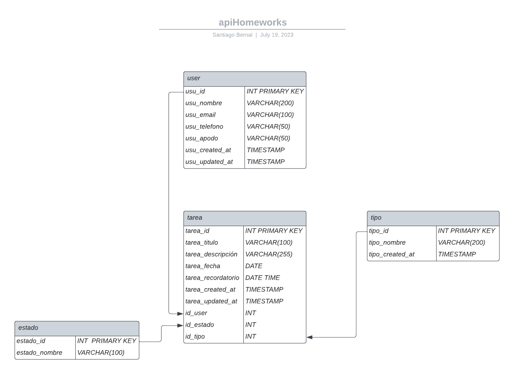

# apiHomeworks
## Objetivo general del proyecto:
Desarrollar una API de tareas que permita a los usuarios gestionar y realizar un seguimiento de sus tareas. La API mostrará las tareas pendientes para los próximos 7 días, brindando a los usuarios una visión clara de sus responsabilidades a corto plazo.

## Objetivo específico del proyecto:
Implementar una funcionalidad en la API de tareas que permita filtrar y mostrar las tareas pendientes que deben completarse en los próximos 7 días. Esto ayudará a los usuarios a organizar y priorizar sus tareas de manera eficiente, proporcionándoles una vista rápida y relevante de sus actividades pendientes a corto plazo. El proyecto se basa en crear una api de tareas la cual va a permitir al usuario registrarse, crear tareas y cada tarea va a estar ligada a un programa es decir: esta tarea es de matematica, o de ingles etc depende el programa, La idea es presentar al usuario las tareas que tenga pendientes en los proximos 7 dias, la base de datos contará con 4 tablas las cuales serán: usuarios, tareas, programas, estado_tarea
